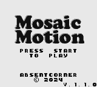
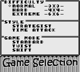
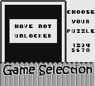
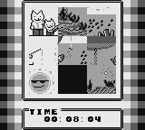
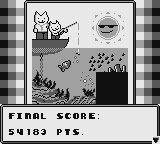

# Mosaic Motion ©️: "The Ultimate Revival Puzzle Game for Nintendo®️ Game Boy™️!"

## Currently in development by Aidan Schneider

### Demo Pictures:

### Thanks for checking out my project!
Feel free to [download the rom and try it yourself](https://github.com/aschneider15/Mosaic-Motion/releases) using the Game Boy emulator of your choice! 

For information about the design process and what features I plan on including by the time this project is finished, please check out [my design document.](/Design%20Document.md)

For anyone wondering, my favorite part to work on so far has been the soundtrack! I'll be uploading oscilloscope views of the whole thing once it's finished on the [Absent Corner YouTube channel](https://youtube.com/@absentcorner), so stay tuned for that!

### Personal Notes:

## Resources

- [Game Boy Pan Docs](https://gbdev.io/pandocs/About.html)
- [GBDK Documentation](https://gbdk-2020.github.io/gbdk-2020/docs)
- [Larold's Jubilant Junkyard](https://laroldsjubilantjunkyard.com/)

## The "Rules":

### Naming Conventions:

- General C language elements

| Item              | Convention                  |
| ----------------- | --------------------------- |
| File Name         | multiple-words.c (.h, etc.) |
| Struct            | TitleCase                   |
| Struct Members    | lower_case                  |
| Enum              | ETitleCase                  |
| Enum Members      | ALL_CAPS                    |
| Functions         | TitleCase                   |
| Trivial variables | i,x,n,f etc...              |
| Local variables   | lower_case                  |
| Global variables  | g_lower_case \*2            |

    - \*1 pfx = two or three letter module prefix
    - \*2 lead with g\_ so that it's easier to lookup globals

- GBKD-specific elements

| Item      | Convention                  |
| --------- | --------------------------- |
| File Name | multiple-words.c (.h, etc.) |
